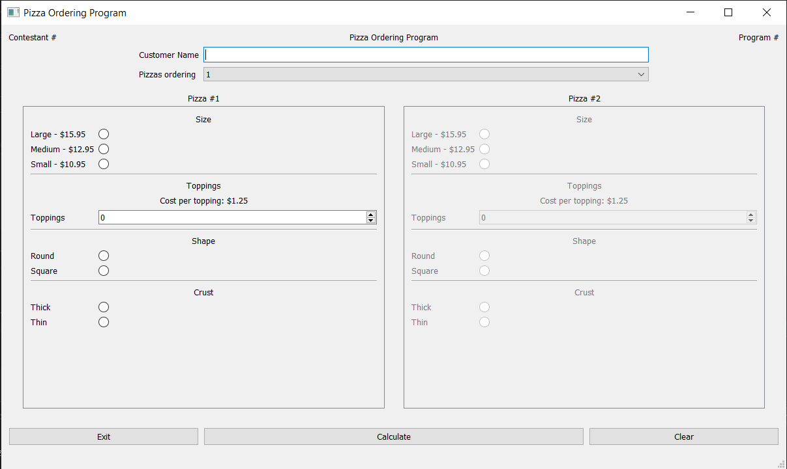
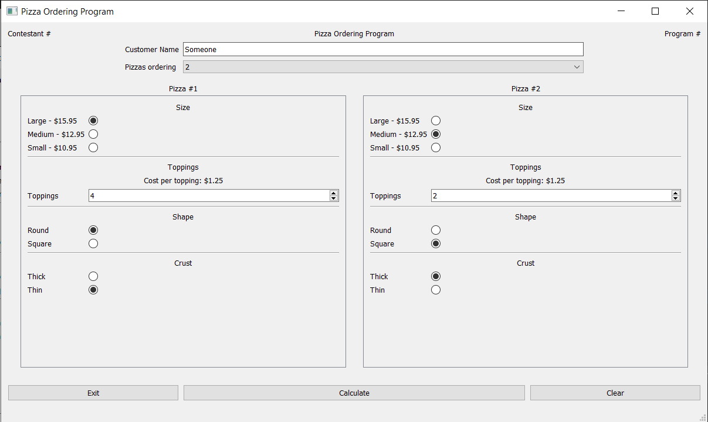

- [Overview](#overview)
- [Gallery](#gallery)
  - [2012-state-md](#2012-state-md)
    - [pyqt5-w-designer](#pyqt5-w-designer)
      - [Program 2](#program-2)

## Overview
Skills stuff.

For each practice problem, if present:
- pyqt5-w-designer: Used Python and PyQt5; Qt Designer used
- pyqt5-no-designer: Used Python and PyQt5; Qt Designer not used
- qtcpp: Used Qt (the actual one)

Note that SkillsUSA:
- does not permit use of online documentation
- does not (appear to) permit Python; only C++, Java, VB
- uses pseudocode for its written protion
- and does not permit "drag-and-drop" (not sure for NV?) programs to aid in UI design

i'm not good enough yet to fulfill any of the above lol

Also note the lack of regular commits - generally I use commits to keep track of my time pace, rather than actual program/feature progression (especially since it can take time)

I will aggressively commit if I have no idea what I'm doing and might want to go back to a different approach though

## Gallery

### 2012-state-md

#### pyqt5-w-designer

##### Program 1

##### Program 2

